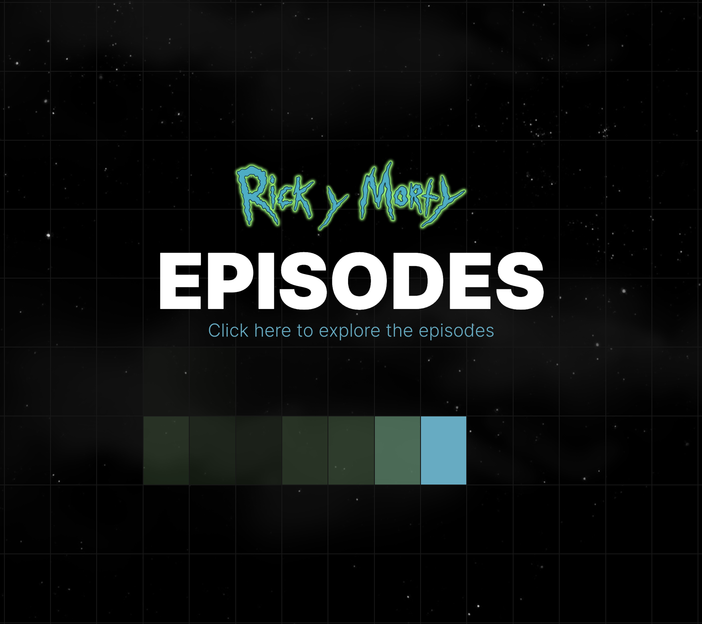

# Rick y Morty Web App

## Tech Stack
Este proyecto está construido usando las siguientes tecnologías y librerías:
- [React](https://reactjs.org/)
- [Next UI](https://nextui.org/)
- [Framer Motion](https://www.framer.com/motion/)
- [React Router](https://reactrouter.com/)
- [Tailwind CSS](https://tailwindcss.com/)
- [TypeScript](https://www.typescriptlang.org/)
- [Vite](https://vitejs.dev/)
- [API Rick y Morty](https://rickandmortyapi.com/)


## Configuración
Sigue estas instrucciones para configurar y ejecutar el proyecto localmente:

1. Clona el repositorio:
   - HTTPS:
     ```bash
     git clone https://github.com/DeversoLabs/rickyandmorty-j2d-hackaton.git
     ```
   - SSH:
     ```bash
     git clone git@github.com:DeversoLabs/rickyandmorty-j2d-hackaton.git
2. Navega al directorio del proyecto:
   ```bash
   cd rickandmorty
3. Instala las dependencias usando npm o yarn:
   ```bash
   npm install
   # o
   yarn install
4. Inicia el servidor de desarrollo:
   ```bash
   npm run dev
   # o
   yarn dev
5. Abre el navegador y visita http://localhost:#### (add the number that appear in your terminal) para ver la aplicación en acción.
## API utilizada
Este proyecto obtiene datos de la API de Rick y Morty, que proporciona información sobre los personajes, localizaciones y episodios de la serie Rick y Morty:

   0. API
      ```bash
      {
         "characters": "https://rickandmortyapi.com/api/character",
         "locations": "https://rickandmortyapi.com/api/location",
         "episodes": "https://rickandmortyapi.com/api/episode"
         }

## Estructura de la página
El proyecto está organizado en las siguientes páginas:
### Inicio
La página de inicio proporciona acceso a tres secciones principales: Personajes, Localizaciones y Episodios.


### Página de Personajes
- Permite a los usuarios explorar todos los personajes de Rick & Morty.
- Obtiene los primeros 20 registros de personajes y proporciona un botón "Cargar más" para obtener 20 registros adicionales cada vez.
- Los usuarios pueden hacer clic en la ficha de un personaje para ver más detalles.


### Página de localizaciones
- Organiza diferentes ubicaciones de la serie en acordeones.
- Cuando se expande un acordeón, los usuarios pueden ver los personajes que aparecieron en esa localización según la API.


### Página de Episodios
- Organiza diferentes episodios de la serie en acordeones.
- Cuando se expande un acordeón, los usuarios pueden ver los personajes que aparecieron en ese episodio según la API.


## CSS
- Se ha incorporado un efecto visual de estrellas parpadeantes y nubes en toda la aplicación web, evocando elementos de los episodios de Rick y Morty para crear una experiencia espacial cautivadora.
- En las páginas de Personajes, Localizaciones y Episodios, hemos introducido una característica destacada en el encabezado: al pasar el ratón sobre él, se despliega una estela de colores llamativos. Además, hemos implementado un efecto interesante en los subtítulos de cada página, donde las letras experimentan cambios en su escala y color al interactuar con el ratón.
- Es importante destacar que la aplicación es totalmente receptiva y se adapta perfectamente a distintos tamaños de pantalla, garantizando una experiencia óptima para todos los usuarios.


## Acceso a la aplicación

- [wubba.netlify.app](https://wubba.netlify.app/)